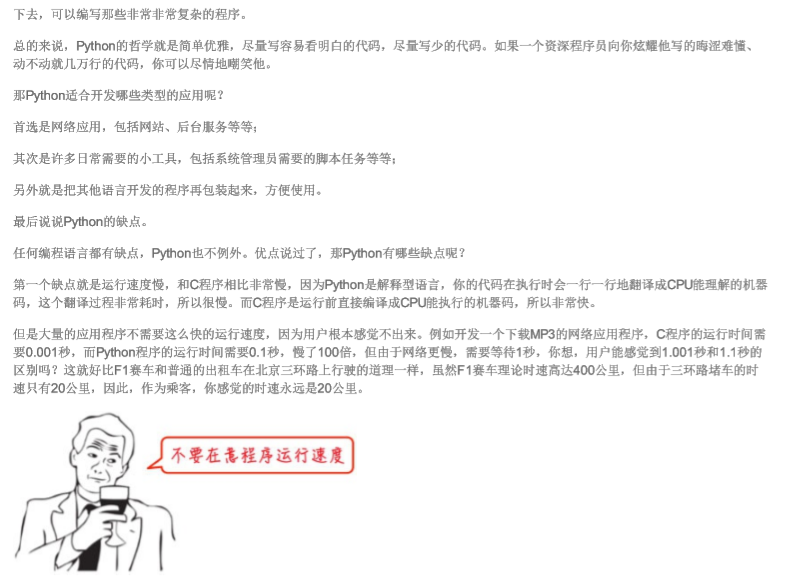

#### This project is used to grab wiki from website of 'liaoxufeng',it is a tutorial：https://www.liaoxuefeng.com/

#### It can be used to crawl all the wiki of him

Version 0.1.0

1.  This is a synchronous crawler

2. The library used is as follows: BeautidfulSoup4, requests, pdfkit, you can `pip install [package]`

3. Use wkhtmltopdf to convert the crawled html to pdf

4. I kept the script and CSS styles in the html file, which makes it look like you see on the web.

3. Distributed and ip proxy pools are not used

5.  I kept the crawled html and pdf, they are in the zip file.

#### Updated: 2019/12/17

Version 0.2.0

Speed up the crawler, extract the required CSS, JS and content, about 7 minutes. Code structure is more reasonable.

I crawled through all the tutorials, which you can download.

However, there is a little disadvantage that the example code does not have syntax highlighting.  In the previous  version, it was right. It will be improved later...

#### Updated: 2019/12/18

Version  0.2.1

fix syntax highlighting.

#### 本项目是从廖雪峰网站获取wiki的一个教程：https://www.liaoxuefeng.com/

#### 它可以用来抓取他所有的博客

版本0.1.0

一、这是一个同步爬虫程序

二、使用的库如下：beautifulsoup4，requests，pdfkit，您可以'pip install[package]`

三、使用wkhtmltopdf将已爬取的html转换为pdf

四、我将脚本和CSS样式保存在html文件中，这使它看起来像是在web上看到的。

五、不使用分布式和ip代理池

六、我保留了已爬取的html和pdf，它们都在zip文件中。

#### 更新日期：2019/12/17

版本0.2.0

加速爬虫，提取所需的CSS，JS和内容，大约5分钟。代码结构更合理。

我下载了所有的教程，你可以下载。

但是，有一点缺点，示例代码没有语法突出显示。在以前的版本中，它是正确的。以后会改进的。。。

#### 更新日期：2019/12/18

版本0.2.0

修复代码语法高亮。

结果：

