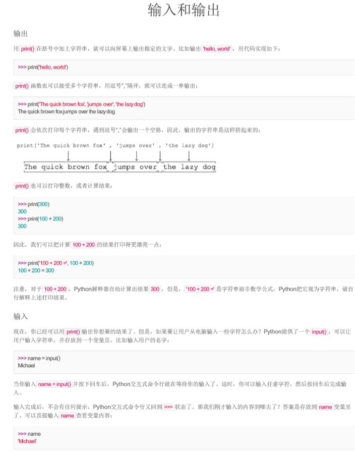

##This projiect is used to grab wiki from website of 'liaoxufeng',it is a tutorial：[https://www.liaoxuefeng.com/wiki/0014316089557264a6b348958f449949df42a6d3a2e542c000](https://www.liaoxuefeng.com/wiki/0014316089557264a6b348958f449949df42a6d3a2e542c000 "廖雪峰python教程")

PS:I started with his Python tutorial

1.  This is a synchronous crawler

2. The library used is as follows: BeautidfulSoup4, requests, pdfkit, you can `pip install [package]`

3. Use wkhtmltopdf to convert the crawled html to pdf

4. I kept the script and css styles in the html file, which makes it look like you see on the web.

3. Distributed and ip proxy pools are not used

5.  I kept the crawled html and pdf, they are in the zip file.
